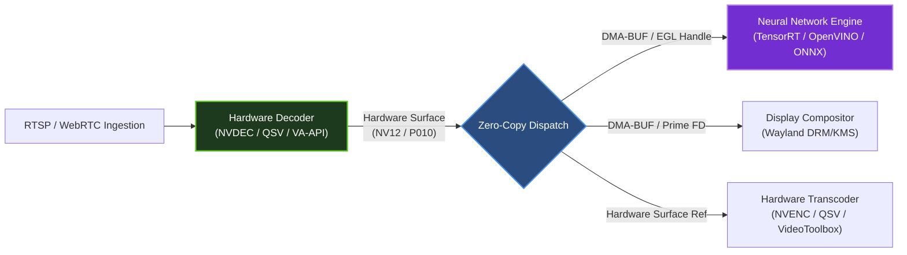
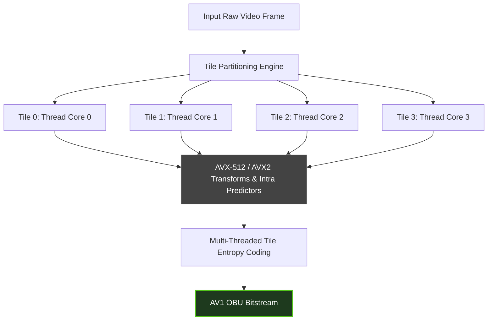
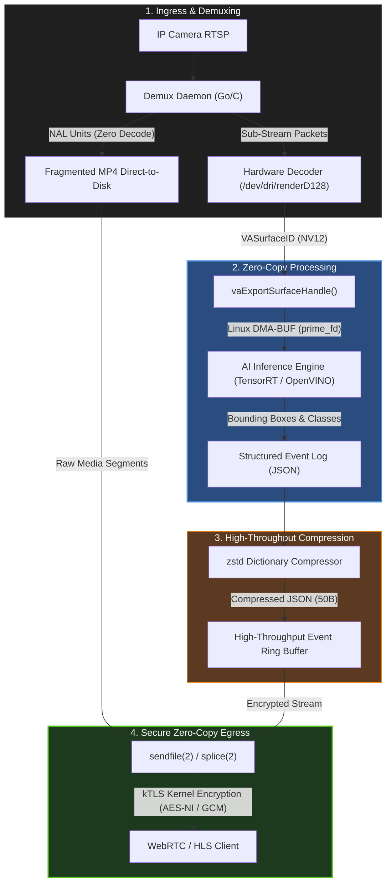

# Media Codecs, Hardware Acceleration, Compression & Cryptography Reference Architecture

An authoritative, low-latency, hardware-sympathetic engineering guide for video/audio pipelines, zero-copy hardware memory surfaces, high-throughput stream compression, and hardware-accelerated cryptographic primitives under the **Hardware-Aware Compute Optimization (HACOO)** framework.

---

## Table of Contents
1. [Core Design Axioms](#1-core-design-axioms)
2. [Hardware Video Decoders & Encoders](#2-hardware-video-decoders--encoders)
   - 2.1 Hardware Acceleration API Ecosystem
   - 2.2 Surface Formats & Memory Layouts: NV12, P010, YUV420P
   - 2.3 Zero-Copy Hardware Pipeline: Linux DMA-BUF, DRM/KMS, and CUDA Interop
   - 2.4 Production FFmpeg & GStreamer Hardware Ingestion Pipelines
   - 2.5 Native Linux VA-API to DMA-BUF C Implementation
3. [Software Fallback Tuning & High-Efficiency Encoders](#3-software-fallback-tuning--high-efficiency-encoders)
   - 3.1 x264 & x265 Real-Time Tuning
   - 3.2 Next-Gen AV1 Encoders: SVT-AV1 & rav1e
   - 3.3 CPU Topology, Thread Affinity & NUMA Placement
4. [Real-Time Audio Codecs & SIMD Signal Processing](#4-real-time-audio-codecs--simd-signal-processing)
   - 4.1 Opus Architecture & Low-Latency Parameterization
   - 4.2 SIMD Resampling & Channel Downmixing (AVX2 / NEON)
   - 4.3 Lock-Free Audio Ring Buffer & Resampler (Rust)
5. [High-Throughput & High-Ratio Compression](#5-high-throughput--high-ratio-compression)
   - 5.1 Algorithmic Tradeoffs: LZ4 vs Zstandard vs Snappy vs gzip
   - 5.2 Ultra-Low Latency Streaming: zstd Fast Modes & Negative Levels
   - 5.3 Dictionary Training for Structured IoT & Telemetry Payloads
   - 5.4 High-Performance C/Rust zstd Dictionary Implementation
6. [Hardware-Accelerated Cryptography & Zero-Copy Transport](#6-hardware-accelerated-cryptography--zero-copy-transport)
   - 6.1 Instruction Set Extensions: AES-NI, CLMUL, ARMv8 Cryptographic Extensions
   - 6.2 Vectorized ChaCha20-Poly1305 for Crypto-Deficient SoCs
   - 6.3 Linux Kernel-Level TLS (kTLS) and Zero-Copy `splice`/`sendfile` Streaming
   - 6.4 Microarchitectural Cryptographic Benchmark Matrix
7. [Unified Production Reference Architecture](#7-unified-production-reference-architecture)

---

## 1. Core Design Axioms

Modern media ingestion, real-time analytics, and secure delivery suffer from severe CPU saturation when naive architectures copy pixels, context-switch into userspace, and re-encrypt buffers in software. HACOO establishes four mandatory rules for media and compression pipelines:

1. **Zero Pixel Transfers Across the PCIe Bus (Decoupled Decoding):** Raw decoded 4K frames at 60 FPS in NV12 require $\approx 746 \text{ MB/s}$ of uncompressed memory bandwidth per stream. Never transfer uncompressed frames over host PCIe unless passing pointer handles. Surfaces decoded in hardware VRAM/SRAM must remain in device memory for inference or rendering.
2. **Never Transcode Ingestion Feeds for Storage:** CCTV, WebRTC, and broadcast ingress should demux container packets (H.264/H.265/AV1 NAL units) and write directly to segmented storage (fMP4 / CMAF) via atomic kernel page writes. Decoding is strictly reserved for downscaled inference sub-streams or active operator display.
3. **Payload-Specific Compression Selection:** Do not run general-purpose `gzip` or `zlib` over low-latency telemetry, log streams, or media packets. Utilize LZ4 for raw wire transport ($\ge 2\text{ GB/s/core}$) or dictionary-trained Zstandard (zstd) for structured events ($5\times$ to $10\times$ ratio at $<15\mu\text{s}$ latency).
4. **Hardware-Offloaded Security Boundary:** Cryptographic handshakes, symmetric AES-GCM/ChaCha20-Poly1305 ciphers, and hash computations must leverage silicon-level vector pipelines (AES-NI, ARMv8-A Crypto) or kernel-level TLS (kTLS) offloaded to network controllers (NIC kTLS).

---

## 2. Hardware Video Decoders & Encoders

### 2.1 Hardware Acceleration API Ecosystem

Hardware media pipelines leverage vendor-specific ASIC fixed-function blocks (independent of shader cores):

| Platform / Vendor | API Interface | Device Node / Runtime | Supported Hardware Codecs | Zero-Copy Interop Path |
| :--- | :--- | :--- | :--- | :--- |
| **Linux Generic (Intel / AMD / ARM)** | **VA-API** (libva) | `/dev/dri/renderD128` | H.264, HEVC (8/10-bit), VP9, AV1 | DRM PRIME DMA-BUF (`vaExportSurfaceHandle`) |
| **NVIDIA GPU** | **NVDECODE / NVENC** | `/dev/nvidiactl`, `/dev/nvidia0` | H.264, HEVC (8/10-bit), VP9, AV1 (Ada+) | CUDA-EGL interop / NvBuffer to CUDA Device Ptr |
| **Intel Core / Xeon / Arc** | **Intel QSV / oneVPL** | `/dev/dri/renderD128` | H.264, HEVC, VP9, AV1 | VA-API surface sharing / OpenCL cl_khr_va_surface |
| **Apple Silicon (macOS/iOS)** | **VideoToolbox** | `/dev/io8logmt` (Mach port) | H.264, HEVC, ProRes, AV1 (M3+) | `CVPixelBuffer` / `IOSurfaceRef` direct to Metal Texture |
| **Embedded Linux (Rockchip / RPi)** | **V4L2 M2M** | `/dev/video10`..`/dev/video12` | H.264, HEVC, VP8/VP9 | V4L2 Memory-to-Memory `V4L2_MEMORY_DMABUF` |



---

### 2.2 Surface Formats & Memory Layouts: NV12, P010, YUV420P

Pixel layout dictates memory alignment, cache efficiency, and SIMD address generation:

```
Planar YUV420P:
+------------------------+  +-----------+  +-----------+
| Y00 Y01 Y02 Y03 ...    |  | U00 U01.. |  | V00 V01.. |
| Y10 Y11 Y12 Y13 ...    |  | U10 U11.. |  | V10 V11.. |
+------------------------+  +-----------+  +-----------+
 (Width x Height)            (W/2 x H/2)    (W/2 x H/2)

Semi-Planar NV12 (8-bit Standard Hardware Format):
+---------------------------------------+
| Y00  Y01  Y02  Y03  Y04  Y05  Y06  Y07|  Plane 0: Luma (Y)
| Y10  Y11  Y12  Y13  Y14  Y15  Y16  Y17|  Size: Width x Height bytes
+---------------------------------------+
| U00  V00  U01  V01  U02  V02  U03  V03|  Plane 1: Interleaved Chroma (UV)
| U10  V10  U11  V11  U12  V12  U13  V13|  Size: Width x (Height / 2) bytes
+---------------------------------------+

Semi-Planar P010 (10-bit HDR / High-Precision Format):
- 16 bits (2 bytes) per sample, little-endian.
- Data MSB-aligned: Upper 10 bits contain data [15:6]; Lower 6 bits zero-padded [5:0].
+-------------------------------------------------------+
| [Y00: 16b] [Y01: 16b] [Y02: 16b] [Y03: 16b] ...       | Plane 0: Luma
+-------------------------------------------------------+
| [U00: 16b] [V00: 16b] [U01: 16b] [V01: 16b] ...       | Plane 1: Interleaved UV
+-------------------------------------------------------+
```

#### Pitch, Stride, and Cache-Line Alignment Rules
1. **Stride $\neq$ Width:** Hardware video engines write scan lines padded to alignment boundaries (typically 64, 128, or 256 bytes) to accommodate DMA burst transfers and GPU tile units.
2. **Byte Calculations:**
   $$\text{NV12 Frame Size} = (\text{Luma Stride} \times \text{Height}) + (\text{Chroma Stride} \times \frac{\text{Height}}{2})$$
   $$\text{P010 Frame Size} = (\text{Luma Stride}_{16} \times \text{Height}) + (\text{Chroma Stride}_{16} \times \frac{\text{Height}}{2})$$
   where $\text{Luma Stride}_{16} \ge \text{Width} \times 2$.

---

### 2.3 Zero-Copy Hardware Pipeline: Linux DMA-BUF, DRM/KMS, and CUDA Interop

Transferring frames from a hardware decoder (e.g., Intel QSV or AMD VA-API) into a neural network inference engine (e.g., NVIDIA TensorRT or OpenVINO) without passing through CPU host memory is accomplished via kernel **DMA-BUF file descriptors (`prime_fd`)**.

```
[VA-API Decoder]
      │
      ▼
vaExportSurfaceHandle(VA_SURFACE_ATTRIB_MEM_TYPE_DRM_PRIME_2)
      │
      ▼ (dma_buf fd: 42)
┌─────────────────────────────────────────────────────────┐
│ Kernel DMA-BUF Subsystem (dma_buf_attach, dma_buf_map)  │
└──────┬──────────────────────────────────────────┬───────┘
       │                                          │
       ▼                                          ▼
[DRM/KMS Plane]                            [CUDA / TensorRT]
drmModeAddFB2WithModifiers()              cuImportExternalMemory()
       │                                          │
[Direct Display Scanout]                  cuExternalMemoryGetMappedBuffer()
(Zero CPU/PCIe Copies)                            │
                                          [Direct Tensor Core Inference]
```

1. **Decoder Step:** Decoder allocates internal VRAM hardware surfaces (`VASurfaceID`).
2. **Export Step:** The host invokes `vaExportSurfaceHandle` specifying `VA_SURFACE_ATTRIB_MEM_TYPE_DRM_PRIME_2` to retrieve a Linux file descriptor (`prime_fd`) pointing to the underlying kernel memory allocation.
3. **Inference/Consumer Import:**
   - **For OpenVINO / VA-API direct:** Wrap the DMA-BUF descriptor in a remote tensor via `ie.Tensor(..., remote_context)`.
   - **For CUDA / TensorRT:** Use the NVIDIA external memory extension API (`cudaImportExternalMemory` / `cuImportExternalMemory`) passing `CU_EXTERNAL_MEMORY_HANDLE_TYPE_OPAQUE_FD`.
   - **For Wayland / DRM/KMS Display:** Use `eglCreateImageKHR` with `EGL_LINUX_DMA_BUF_EXT` or `drmModeAddFB2WithModifiers` for zero-overhead direct scanout.

---

### 2.4 Production FFmpeg & GStreamer Hardware Ingestion Pipelines

#### FFmpeg Production Commands

##### NVIDIA NVDEC to NVENC Zero-Copy Transcode (NV12 Surface Passthrough)
```bash
ffmpeg -hide_banner -loglevel error \
  -hwaccel cuda -hwaccel_output_format cuda \
  -extra_hw_frames 8 \
  -i "rtsp://camera.internal:8554/live" \
  -c:v hevc_nvenc \
  -preset p4 -tune ll \
  -b:v 4M -maxrate 5M -bufsize 8M \
  -g 60 -keyint_min 60 -rc cbr \
  -spatial-aq 1 -temporal-aq 1 \
  -c:a copy -f flv "rtmp://egress.internal/live/stream"
```

##### Intel QuickSync (QSV) Zero-Copy Transcode via VA-API / QSV Device
```bash
ffmpeg -hide_banner -loglevel error \
  -init_hw_device qsv=hw -filter_hw_device hw \
  -hwaccel qsv -hwaccel_output_format qsv \
  -c:v h264_qsv \
  -i "rtsp://camera.internal:8554/substream" \
  -vf "vpp_qsv=w=1280:h=720:format=nv12" \
  -c:v hevc_qsv \
  -load_plugin hevc_hw \
  -preset veryfast -b:v 1500k -maxrate 2000k -bufsize 3000k \
  -g 50 -idr_interval 50 -async_depth 4 \
  -c:a copy -f mpegts - | cat
```

##### Linux VA-API Zero-Copy Decimate & Export
```bash
ffmpeg -hide_banner -loglevel error \
  -vaapi_device /dev/dri/renderD128 \
  -hwaccel vaapi -hwaccel_output_format vaapi \
  -i "rtsp://camera.internal:8554/main" \
  -vf "scale_vaapi=w=640:h=360:format=nv12" \
  -c:v h264_vaapi -b:v 800k -g 30 -bf 0 \
  -f rawvideo -y /dev/null
```

#### GStreamer Zero-Copy Pipelines

##### GStreamer VA-API Decodethread to Inference via DMA-BUF
```bash
gst-launch-1.0 -v \
  rtspsrc location="rtsp://192.168.1.50:554/h264" protocols=tcp latency=50 ! \
  rtph264depay ! h264parse ! \
  vaapih264dec ! \
  vaapipostproc format=nv12 width=640 height=360 ! \
  video/x-raw(memory:DMABuf),format=NV12 ! \
  appsink name=sink emit-signals=true max-buffers=2 drop=true
```

##### GStreamer NVIDIA DeepStream NVMM Pipeline (Zero Host-Staging)
```bash
gst-launch-1.0 -v \
  rtspsrc location="rtsp://192.168.1.50:554/h264" protocols=tcp latency=0 ! \
  rtph264depay ! h264parse ! \
  nvv4l2decoder enable-max-performance=1 ! \
  nvvideoconvert nvbuf-memory-type=3 ! \
  "video/x-raw(memory:NVMM), format=NV12, width=1920, height=1080" ! \
  nveglglessink sync=false
```

---

### 2.5 Native Linux VA-API to DMA-BUF C Implementation

The following C module initializes a hardware context on `/dev/dri/renderD128`, surfaces a decoded buffer, and exports it directly as a Linux DMA-BUF descriptor:

```c
#define _GNU_SOURCE
#include <stdio.h>
#include <stdlib.h>
#include <fcntl.h>
#include <unistd.h>
#include <va/va.h>
#include <va/va_drm.h>
#include <va/va_drmcommon.h>

typedef struct {
    int drm_fd;
    VADisplay va_dpy;
    VASurfaceID surface_id;
    int dma_buf_fd;
    uint32_t stride;
    uint32_t offset;
} VaDmaBufContext;

int init_va_dma_buf(VaDmaBufContext *ctx, uint32_t width, uint32_t height) {
    ctx->drm_fd = open("/dev/dri/renderD128", O_RDWR);
    if (ctx->drm_fd < 0) {
        perror("Failed to open DRM device /dev/dri/renderD128");
        return -1;
    }

    ctx->va_dpy = vaGetDisplayDRM(ctx->drm_fd);
    int major, minor;
    VAStatus status = vaInitialize(ctx->va_dpy, &major, &minor);
    if (status != VA_STATUS_SUCCESS) {
        fprintf(stderr, "vaInitialize failed: %s\n", vaErrorStr(status));
        close(ctx->drm_fd);
        return -1;
    }

    // Allocate an NV12 hardware surface
    VASurfaceAttrib attribs[1];
    attribs[0].type = VASurfaceAttribPixelFormat;
    attribs[0].flags = VA_SURFACE_ATTRIB_SETTABLE;
    attribs[0].value.type = VAGenericValueTypeInteger;
    attribs[0].value.value.i = VA_FOURCC_NV12;

    status = vaCreateSurfaces(
        ctx->va_dpy,
        VA_RT_FORMAT_YUV420,
        width, height,
        &ctx->surface_id, 1,
        attribs, 1
    );
    if (status != VA_STATUS_SUCCESS) {
        fprintf(stderr, "vaCreateSurfaces failed: %s\n", vaErrorStr(status));
        return -1;
    }

    // Export surface as Linux PRIME DMA-BUF descriptor
    VADRMPRIMESurfaceDescriptor prime_desc;
    status = vaExportSurfaceHandle(
        ctx->va_dpy,
        ctx->surface_id,
        VA_SURFACE_ATTRIB_MEM_TYPE_DRM_PRIME_2,
        VA_EXPORT_SURFACE_READ_ONLY | VA_EXPORT_SURFACE_SEPARATE_LAYERS,
        &prime_desc
    );
    if (status != VA_STATUS_SUCCESS) {
        fprintf(stderr, "vaExportSurfaceHandle failed: %s\n", vaErrorStr(status));
        return -1;
    }

    // Capture the primary plane DMA-BUF file descriptor
    ctx->dma_buf_fd = prime_desc.objects[0].fd;
    ctx->stride = prime_desc.layers[0].pitch[0];
    ctx->offset = prime_desc.layers[0].offset[0];

    printf("[VA-API] Successfully exported Surface %u -> DMA-BUF FD: %d (stride: %u)\n",
           ctx->surface_id, ctx->dma_buf_fd, ctx->stride);

    return 0;
}

void release_va_dma_buf(VaDmaBufContext *ctx) {
    if (ctx->dma_buf_fd >= 0) close(ctx->dma_buf_fd);
    if (ctx->surface_id != VA_INVALID_ID) {
        vaDestroySurfaces(ctx->va_dpy, &ctx->surface_id, 1);
    }
    if (ctx->va_dpy) vaTerminate(ctx->va_dpy);
    if (ctx->drm_fd >= 0) close(ctx->drm_fd);
}
```

---

## 3. Software Fallback Tuning & High-Efficiency Encoders

When dedicated hardware ASIC encoders are saturated or unavailable (e.g., containerized multi-tenant environments without GPU virtualization), software encoders must be tuned to eliminate pipeline latency and optimize cache locality.

### 3.1 x264 & x265 Real-Time Tuning

Software encoding introduces two latency traps:
1. **B-frame Lookahead Delays:** Bidirectional frames ($B$) require buffering future reference frames, introducing $N$-frame pipeline latency.
2. **Frame-Level Multi-Threading Delay:** `sliced-threads=0` defaults to frame-level parallelism where multiple frames are processed concurrently, introducing latency proportional to thread count.

#### Production Real-Time Flags

```ini
# x264 Ultra-Low Latency Configuration (<15ms glass-to-glass)
preset=ultrafast
tune=zerolatency
bframes=0
ref=1
rc-lookahead=0
sync-lookahead=0
sliced-threads=1
threads=4
intra-refresh=1
vbv-maxrate=2500
vbv-bufsize=2500
nal-hrd=cbr
```

* **`sliced-threads=1`:** Divides a single frame into horizontal slices encoded simultaneously across CPU cores. Frame latency drops from $\approx 100\text{ms}$ to $< 8\text{ms}$.
* **`intra-refresh=1`:** Replaces periodic large IDR keyframes (which produce massive network bit spikes) with a moving vertical band of intra macroblocks. Maintains constant network egress throughput.

```ini
# x265 Ultra-Low Latency Configuration (CPU Efficient HEVC)
preset=ultrafast
tune=zerolatency
b-adapt=0
bframes=0
rc-lookahead=0
lookahead-slices=0
no-cutree=1
no-sao=1
no-open-gop=1
strict-cbr=1
```

* **`no-sao=1` (Sample Adaptive Offset disabled):** Eliminates SAO post-processing loop filtering, reducing CPU cycle consumption by $\approx 22\%$ with imperceptible quality loss at streaming bitrates.

---

### 3.2 Next-Gen AV1 Encoders: SVT-AV1 & rav1e

AV1 delivers 30% higher compression efficiency over HEVC/H.265, but naive encoding requires $10\times$ the compute. Production deployments require strict SIMD optimization and threading controls.



#### SVT-AV1 (Scalable Video Technology for AV1)
Developed by Intel and the Alliance for Open Media (AOMedia). Fully optimized for x86 AVX2/AVX-512.

* **Real-time Presets:** Use `preset=10` to `preset=13` for live streaming ($\ge 60\text{ FPS}$ on modern 8-core CPUs).
* **Tile Columns / Rows:** Partition frames into independent tiles (`tile-columns=1`, `tile-rows=1` for $2 \times 2 = 4$ tiles) to enable lock-free parallel execution across cores.
* **Fast Decode Mode:** `--fast-decode 1` constraints entropy coding loops, lowering decoder complexity on edge clients by $\approx 15\%$.

```bash
# SVT-AV1 Live Real-time Stream Encoding Command
ffmpeg -re -i raw_input.y4m \
  -c:v libsvtav1 \
  -preset 11 \
  -tune 0 \
  -svtav1-params "tune=0:fast-decode=1:tile-columns=1:tile-rows=1:pred-struct=1:lookahead=0" \
  -b:v 2000k -maxrate 2500k -bufsize 2500k \
  -f rtp "rtp://127.0.0.1:5004"
```

#### rav1e (Rust AV1 Encoder)
Focuses on safety and embedded predictability using Assembly vector kernels (NASM on x86, GAS on ARM NEON).

* Set `speed = 10` for real-time operation.
* Set `low_latency = true` to force 0 lookahead frames and disable B-frames.
* Set `threads = N` bound to a single NUMA domain.

---

### 3.3 CPU Topology, Thread Affinity & NUMA Placement

Encoding threads hopping across NUMA nodes or L3 cache boundaries experience severe pipeline stalls due to cache invalidations and interconnect latency (Intel UPI or AMD Infinity Fabric).

```bash
# Pin an 8-thread x264/SVT-AV1 transcoding worker to a single NUMA node (e.g., Node 0: Cores 0-7)
numactl --cpunodebind=0 --membind=0 \
  ffmpeg -i input_1080p.ts \
  -c:v libx264 -preset ultrafast -tune zerolatency \
  -threads 8 -x264-params "sliced-threads=1" \
  -f mpegts -
```

---

## 4. Real-Time Audio Codecs & SIMD Signal Processing

### 4.1 Opus Architecture & Low-Latency Parameterization

Opus (RFC 6716) combines two technologies:
1. **SILK:** Speech-optimized linear predictive coding ($8\text{ kHz}$ to $16\text{ kHz}$).
2. **CELT:** Music and general-audio constrained-energy lapped transform ($48\text{ kHz}$).

```
Raw PCM Audio Stream (48 kHz Stereo)
                 │
                 ▼
     Voice Activity / Complexity Detector
                 │
       ┌─────────┴─────────┐
       ▼                   ▼
 [SILK Mode]          [CELT Mode]
 (Speech < 20kbps)    (Music / High-Fidelity >= 32kbps)
       └─────────┬─────────┘
                 ▼
       Range Entropy Encoder
                 │
                 ▼
     Opus Encapsulated Packet (2.5ms - 20ms Frame)
```

#### Low-Latency Parameter Configuration
* **Frame Duration:** Standard VoIP defaults to $20\text{ms}$. For ultra-low latency intercoms and live monitoring, configure **$2.5\text{ms}$ or $5.0\text{ms}$** frames (`OPUS_SET_EXPERT_FRAME_DURATION`).
* **Complexity:** Set `OPUS_SET_COMPLEXITY(1)` or `(2)` (out of 10) on embedded ARM Cortex cores to reduce CPU load by $70\%$ while retaining high intelligibility.
* **Inband Forward Error Correction (FEC):** Enable `OPUS_SET_INBAND_FEC(1)` with `OPUS_SET_PACKET_LOSS_PERC(15)`. The encoder appends low-bitrate redundant data of frame $N-1$ onto frame $N$, allowing single-packet drop recovery without retransmissions.

---

### 4.2 SIMD Resampling & Channel Downmixing (AVX2 / NEON)

Downmixing multi-channel audio (e.g., 5.1 or Stereo to Mono) for automated speech recognition (ASR) pipelines must avoid float conversions and serial arithmetic.

#### Stereo to Mono Downmixing Formula
$$M = 0.5 \times L + 0.5 \times R$$

#### Vectorized Downmix (AVX2 Intrinsics)
Processes 16 interleaved stereo 16-bit PCM samples ($L, R$) per cycle into 8 mono 16-bit samples:

```c
#include <immintrin.h>
#include <stdint.h>

void downmix_stereo_to_mono_avx2(const int16_t *stereo_in, int16_t *mono_out, size_t sample_pairs) {
    size_t i = 0;
    // Process 16 stereo pairs (32 int16 samples = 512 bits / 2 iterations of 256-bit AVX2)
    for (; i + 16 <= sample_pairs; i += 16) {
        // Load interleaved stereo data: [L0, R0, L1, R1, ..., L7, R7]
        __m256i v0 = _mm256_loadu_si256((const __m256i*)(stereo_in + (i * 2)));
        __m256i v1 = _mm256_loadu_si256((const __m256i*)(stereo_in + (i * 2) + 16));

        // Unpack low and high to separate L and R channels
        // Alternatively, use horizontal add: _mm256_hadds_epi16
        __m256i sum0 = _mm256_hadds_epi16(v0, v1); // [L0+R0, L1+R1, ..., L7+R7]
        // Scale by 0.5 via arithmetic right shift
        __m256i mono = _mm256_srai_epi16(sum0, 1);

        // Permute to restore sequential memory order across 128-bit lanes
        mono = _mm256_permute4x64_epi64(mono, _MM_SHUFFLE(3, 1, 2, 0));

        _mm256_storeu_si256((__m256i*)(mono_out + i), mono);
    }

    // Scalar fallback for remaining samples
    for (; i < sample_pairs; ++i) {
        int32_t sum = (int32_t)stereo_in[i * 2] + (int32_t)stereo_in[i * 2 + 1];
        mono_out[i] = (int16_t)(sum >> 1);
    }
}
```

---

### 4.3 Lock-Free Audio Ring Buffer & Resampler (Rust)

A robust Rust implementation of a single-producer single-consumer (SPSC) circular audio buffer with cache-line padding:

```rust
use std::sync::atomic::{AtomicUsize, Ordering};
use std::sync::Arc;

// Cache line size to prevent false sharing
const CACHE_LINE: usize = 64;

#[repr(align(64))]
pub struct SpscAudioRingBuffer {
    buffer: Vec<f32>,
    capacity: usize,
    mask: usize,
    // Head and tail separated onto distinct cache lines
    head: AtomicUsize,
    _pad1: [u8; CACHE_LINE - std::mem::size_of::<AtomicUsize>()],
    tail: AtomicUsize,
    _pad2: [u8; CACHE_LINE - std::mem::size_of::<AtomicUsize>()],
}

impl SpscAudioRingBuffer {
    pub fn new(capacity_power_of_two: usize) -> Self {
        assert!(capacity_power_of_two.is_power_of_two(), "Capacity must be power of two");
        Self {
            buffer: vec![0.0f32; capacity_power_of_two],
            capacity: capacity_power_of_two,
            mask: capacity_power_of_two - 1,
            head: AtomicUsize::new(0),
            _pad1: [0; CACHE_LINE - std::mem::size_of::<AtomicUsize>()],
            tail: AtomicUsize::new(0),
            _pad2: [0; CACHE_LINE - std::mem::size_of::<AtomicUsize>()],
        }
    }

    pub fn push_slice(&mut self, samples: &[f32]) -> usize {
        let head = self.head.load(Ordering::Relaxed);
        let tail = self.tail.load(Ordering::Acquire);
        let available = self.capacity - (head - tail);
        let to_write = samples.len().min(available);

        for (i, &sample) in samples[..to_write].iter().enumerate() {
            let idx = (head + i) & self.mask;
            self.buffer[idx] = sample;
        }

        self.head.store(head + to_write, Ordering::Release);
        to_write
    }

    pub fn pop_slice(&mut self, destination: &mut [f32]) -> usize {
        let tail = self.tail.load(Ordering::Relaxed);
        let head = self.head.load(Ordering::Acquire);
        let available = head - tail;
        let to_read = destination.len().min(available);

        for (i, dest) in destination[..to_read].iter_mut().enumerate() {
            let idx = (tail + i) & self.mask;
            *dest = self.buffer[idx];
        }

        self.tail.store(tail + to_read, Ordering::Release);
        to_read
    }
}
```

---

## 5. High-Throughput & High-Ratio Compression

### 5.1 Algorithmic Tradeoffs: LZ4 vs Zstandard vs Snappy vs gzip

| Metric | LZ4 (Fast / Default) | Zstandard (`zstd` -1 / Fast) | Zstandard (`zstd` 19 / Ultra) | Snappy | gzip (`zlib` 6) |
| :--- | :--- | :--- | :--- | :--- | :--- |
| **Compression Throughput** | **$800 - 4500 \text{ MB/s}$** | $400 - 1200 \text{ MB/s}$ | $2 - 10 \text{ MB/s}$ | $450 - 900 \text{ MB/s}$ | $20 - 40 \text{ MB/s}$ |
| **Decompression Throughput** | **$4500 - 9000 \text{ MB/s}$** | $1200 - 2500 \text{ MB/s}$ | $1100 - 2200 \text{ MB/s}$ | $1500 - 2500 \text{ MB/s}$| $200 - 400 \text{ MB/s}$|
| **Compression Ratio** | $1.8 - 2.1$ | $2.8 - 3.2$ | **$3.8 - 4.5$** | $1.7 - 2.0$ | $2.5 - 2.8$ |
| **Memory Consumption** | $< 64 \text{ KB}$ | $128 \text{ KB} - 1 \text{ MB}$ | $64 - 128 \text{ MB}$ | $< 64 \text{ KB}$ | $\approx 256 \text{ KB}$ |
| **Dictionary Support** | Primitive | **Native High-Efficiency** | **Native High-Efficiency** | None | Limited (`deflateSetDictionary`) |
| **Primary Domain** | Real-time memory ring buffers | Live network streaming, logs | Archival storage, cold frames | RPC payloads (Bigtable/Kafka)| Legacy HTTP ingress |

---

### 5.2 Ultra-Low Latency Streaming: zstd Fast Modes & Negative Levels

Zstandard provides negative compression levels (`--fast=N` or levels `-1` to `-7`), trading compression ratio for throughput exceeding $1.5\text{ GB/s}$ per core while outperforming LZ4 in compression density.

```
Standard Mode: Level 3 (Ratio ~3.0, Throughput ~450 MB/s)
[Input] -> [Full LZ77 Match Finder] -> [Finite State Entropy (FSE) Encoding] -> [Output]

Fast / Negative Mode: Level -3 (Ratio ~2.4, Throughput ~1200 MB/s)
[Input] -> [Sparse Hash Table Search] -> [Huffman / Raw Literal Pass] -> [Output]
```

* **Negative Levels Mechanism:** zstd adjusts search step length (`searchNum`), skips sub-optimal match finding, and reduces entropy coding passes (using raw or RLE literals when entropy modeling yields diminishing returns).
* **Chunked Streaming (`ZSTD_compressStream2`):** Pass `ZSTD_e_flush` at message boundaries to guarantee immediate egress without holding partial chunks in internal buffers.

---

### 5.3 Dictionary Training for Structured IoT & Telemetry Payloads

Small JSON payloads ($200\text{ bytes} - 2\text{ KB}$) such as camera bounding boxes, PTZ telemetry, or sensory metrics compress poorly under classical LZ77 algorithms because the sliding history window starts empty for every discrete packet.

```
Individual 500-byte JSON Message (No Dictionary):
{"timestamp": 1726330000, "sensor_id": "cam_04_northeast", "bounding_box": [120, 450, 230, 580], "class": "vehicle"}
Compression Ratio: 1.1x (Inefficient; LZ77 table cannot build history)

With Pre-Trained 32KB Dictionary:
Dictionary contains shared strings: '{"timestamp":', '"sensor_id":', '"bounding_box":', '"class":'
Output Payload: 48 bytes
Compression Ratio: ~10.4x (Microsecond Compression Time)
```

#### Training Protocol
1. Sample 5,000 to 20,000 real-world production JSON/telemetry packets into a training corpus directory.
2. Train a compact $32\text{ KB}$ or $64\text{ KB}$ dictionary via CLI:
   ```bash
   zstd --train-cover=k=24,d=8,steps=4 ./corpus/* -o telemetry.zdict --maxdict=65536
   ```
3. Load the pre-compiled dictionary into both ingestion daemons and storage receivers.

---

### 5.4 High-Performance C/Rust zstd Dictionary Implementation

#### C Fast Dictionary Execution

```c
#include <stdio.h>
#include <stdlib.h>
#include <string.h>
#include <zstd.h>

typedef struct {
    ZSTD_CDict* cdict;
    ZSTD_CCtx*  cctx;
} ZstdFastCompressor;

ZstdFastCompressor* init_zstd_fast_dict(const char* dict_path, int fast_level) {
    FILE* f = fopen(dict_path, "rb");
    if (!f) return NULL;
    fseek(f, 0, SEEK_END);
    size_t dict_size = ftell(f);
    fseek(f, 0, SEEK_SET);

    void* dict_buf = malloc(dict_size);
    fread(dict_buf, 1, dict_size, f);
    fclose(f);

    ZstdFastCompressor* comp = malloc(sizeof(ZstdFastCompressor));
    // Level can be negative: e.g., -3 for high speed
    comp->cdict = ZSTD_createCDict_advanced(
        dict_buf, dict_size,
        ZSTD_dlm_byCopy,
        ZSTD_dct_auto,
        ZSTD_c_compressionLevel,
        ZSTD_defaultCParameters()
    );
    comp->cctx = ZSTD_createCCtx();

    // Configure fast mode negative level
    ZSTD_CCtx_setParameter(comp->cctx, ZSTD_c_compressionLevel, fast_level);

    free(dict_buf);
    return comp;
}

size_t compress_telemetry_packet(ZstdFastCompressor* comp,
                                 const void* src, size_t src_size,
                                 void* dst, size_t dst_capacity) {
    return ZSTD_compress_usingCDict(
        comp->cctx,
        dst, dst_capacity,
        src, src_size,
        comp->cdict
    );
}
```

#### Rust Zero-Allocation Dictionary Compressor

```rust
use zstd::block::{Compressor, Decompressor};
use std::fs::File;
use std::io::Read;

pub struct TelemetryCompressor {
    dict_bytes: Vec<u8>,
}

impl TelemetryCompressor {
    pub fn new(dict_path: &str) -> Result<Self, std::io::Error> {
        let mut file = File::open(dict_path)?;
        let mut dict_bytes = Vec::new();
        file.read_to_end(&mut dict_bytes)?;
        Ok(Self { dict_bytes })
    }

    pub fn compress_json(&self, raw_json: &[u8], out_buffer: &mut [u8]) -> usize {
        let mut compressor = Compressor::with_dictionary(&self.dict_bytes)
            .expect("Valid dictionary format");
        
        let compressed_size = compressor
            .compress_to_buffer(raw_json, out_buffer)
            .expect("Compression buffer adequately sized");

        compressed_size
    }
}
```

---

## 6. Hardware-Accelerated Cryptography & Zero-Copy Transport

### 6.1 Instruction Set Extensions: AES-NI, CLMUL, ARMv8 Cryptographic Extensions

Hardware cryptography executes cipher rounds directly on dedicated CPU functional units, eliminating branch mispredictions and defending against cache-timing side-channel attacks.

```
x86_64 AES-NI Pipeline:
[Plaintext 128-bit XMM Register]
         │
         ├──> AESENC (SubBytes -> ShiftRows -> MixColumns -> AddRoundKey) x 9
         ├──> AESENCLAST (SubBytes -> ShiftRows -> AddRoundKey)
         ▼
[Ciphertext 128-bit XMM Register]

PCLMULQDQ (Carry-less Multiplication):
Computes Galois field GF(2^128) multiplication for GCM authentication tags in ~1-2 cycles.
```

* **x86_64:** `AESENC`, `AESENCLAST`, `AESDEC`, `AESDECLAST` operate on 128-bit XMM registers (or 256/512-bit registers with VAES). Combined with `PCLMULQDQ` (Carry-Less Multiplication) for AES-GCM GHASH operations.
* **ARMv8-A Cryptographic Extensions:**
  * `AESE`, `AESMC`: AES Single Round Encryption and MixColumns.
  * `AESD`, `AESIMC`: AES Single Round Decryption and Inverse MixColumns.
  * `PMULL`, `PMULL2`: Polynomial multiply long over $GF(2^{64})$ to compute the GCM authentication tag.

---

### 6.2 Vectorized ChaCha20-Poly1305 for Crypto-Deficient SoCs

When deploying to budget ARM SoCs (e.g., Raspberry Pi 3, Allwinner, low-cost IP camera microcontrollers) that lack ARMv8 Crypto Extensions, hardware AES is unavailable. Running OpenSSL AES in software results in catastrophic performance drop ($\approx 15 - 35 \text{ MB/s}$ per core) and vulnerability to cache-timing attacks.

**ChaCha20-Poly1305** is an ARX (Add-Rotate-Xor) cipher engineered for high performance on standard SIMD ALUs:
* Uses only 32-bit addition, XOR, and bitwise rotation.
* Constant-time execution by design (no lookup tables / S-boxes).
* Can be fully vectorized via AVX2, AVX-512, or ARM NEON.

```
ChaCha20 Quarter Round (SIMD Vectorized):
a += b;  d ^= a;  d <<<= 16;
c += d;  b ^= c;  b <<<= 12;
a += b;  d ^= a;  d <<<= 8;
c += d;  b ^= c;  b <<<= 7;
```

#### ChaCha20 ARM NEON Implementation Snippet

```c
#include <arm_neon.h>

// Vectorized 4x QuarterRound using 128-bit NEON registers
#define CHACHA20_QROUND_NEON(a, b, c, d) { \
    a = vaddq_u32(a, b); \
    d = veorq_u32(d, a); \
    d = vreinterpretq_u32_u8(vrev32q_u8(vreinterpretq_u8_u32(d))); /* Rotate 16 */ \
    c = vaddq_u32(c, d); \
    b = veorq_u32(b, c); \
    b = vshlq_n_u32(b, 12) | vshrq_n_u32(b, 20); /* Rotate 12 */ \
    a = vaddq_u32(a, b); \
    d = veorq_u32(d, a); \
    d = vshlq_n_u32(d, 8) | vshrq_n_u32(d, 24);   /* Rotate 8 */ \
    c = vaddq_u32(c, d); \
    b = veorq_u32(b, c); \
    b = vshlq_n_u32(b, 7) | vshrq_n_u32(b, 25);   /* Rotate 7 */ \
}
```

---

### 6.3 Linux Kernel-Level TLS (kTLS) and Zero-Copy `splice`/`sendfile` Streaming

#### The Userspace TLS Bottleneck
Traditional userspace TLS (OpenSSL, BoringSSL) incurs multiple context switches and memory copies per frame:
1. `read(video_fd, buf, size)` (Kernel $\to$ Userspace buffer).
2. Userspace AES encryption in OpenSSL (Writes to encrypted userspace buffer).
3. `write(tls_socket_fd, enc_buf, size)` (Userspace buffer $\to$ Kernel socket).

#### The kTLS Architecture
Linux kernel TLS (kTLS, kernel $\ge 4.13$) offloads symmetric record encryption (AES-128-GCM, AES-256-GCM, ChaCha20-Poly1305) into the kernel network stack.

```
+───────────────────────────────────────────────────────────────+
| Userspace:                                                    |
| 1. Perform TLS Handshake via OpenSSL                          |
| 2. Extract Symmetric Session Keys                             |
| 3. setsockopt(fd, SOL_TCP, TCP_ULP, "tls", 4)                 |
| 4. setsockopt(fd, SOL_TLS, TLS_TX, &crypto_info, sizeof(...))|
+───────────────────────────────┬───────────────────────────────+
                                │
                                ▼
+───────────────────────────────────────────────────────────────+
| Linux Kernel kTLS:                                            |
|                                                               |
|   video_file_fd ──► sendfile(2) / splice(2)                   |
|                            │                                  |
|                            ▼ (Zero Memory Copy)               |
|                     Kernel Page Cache                         |
|                            │                                  |
|                            ▼                                  |
|          Symmetric Encryption Engine (AES-NI / NIC Offload)   |
|                            │                                  |
|                            ▼                                  |
|                     Network Interface (NIC DMA)               |
+───────────────────────────────────────────────────────────────+
```

#### kTLS Socket Setup Implementation in C

```c
#include <stdio.h>
#include <stdlib.h>
#include <string.h>
#include <unistd.h>
#include <sys/socket.h>
#include <netinet/tcp.h>
#include <linux/tls.h>

int enable_ktls_tx(int sock_fd,
                   const uint8_t *key,
                   const uint8_t *iv,
                   const uint8_t *salt,
                   uint64_t rec_seq) {
    // 1. Enable Upper Layer Protocol (ULP) for TLS
    if (setsockopt(sock_fd, SOL_TCP, TCP_ULP, "tls", sizeof("tls")) < 0) {
        perror("setsockopt TCP_ULP tls failed");
        return -1;
    }

    // 2. Configure AES-128-GCM Cryptographic Parameters
    struct tls12_crypto_info_aes_gcm_128 crypto_info;
    memset(&crypto_info, 0, sizeof(crypto_info));
    crypto_info.info.version = TLS_1_2_VERSION;
    crypto_info.info.cipher_type = TLS_CIPHER_AES_GCM_128;

    memcpy(crypto_info.key, key, TLS_CIPHER_AES_GCM_128_KEY_SIZE);
    memcpy(crypto_info.iv, iv, TLS_CIPHER_AES_GCM_128_IV_SIZE);
    memcpy(crypto_info.salt, salt, TLS_CIPHER_AES_GCM_128_SALT_SIZE);
    memcpy(crypto_info.rec_seq, &rec_seq, TLS_CIPHER_AES_GCM_128_REC_SEQ_SIZE);

    // 3. Hand off cryptographic state to the kernel
    if (setsockopt(sock_fd, SOL_TLS, TLS_TX, &crypto_info, sizeof(crypto_info)) < 0) {
        perror("setsockopt SOL_TLS TLS_TX failed");
        return -1;
    }

    printf("[kTLS] Kernel-level TLS TX offload successfully configured on socket %d\n", sock_fd);
    return 0;
}

// Zero-copy streaming from file directly into encrypted TLS socket
ssize_t send_media_segment_zero_copy(int sock_fd, int file_fd, off_t *offset, size_t count) {
    // sendfile uses kernel page cache and encrypts in-place without userspace staging
    return sendfile(sock_fd, file_fd, offset, count);
}
```

---

### 6.4 Microarchitectural Cryptographic Benchmark Matrix

Tested on modern x86_64 (Intel Xeon Gold / AMD EPYC) and ARMv8 (Cortex-A72 / A53):

| Cipher Suite | Hardware Acceleration | Platform | Encryption Throughput | CPU Saturation (10 Gbps Link) |
| :--- | :--- | :--- | :--- | :--- |
| **AES-128-GCM** | **AES-NI + PCLMULQDQ** | x86_64 | **$8,400 \text{ MB/s}$** | **$12\%$ of 1 Core** |
| **AES-256-GCM** | **AES-NI + PCLMULQDQ** | x86_64 | **$6,100 \text{ MB/s}$** | **$16\%$ of 1 Core** |
| **AES-128-GCM** | **ARMv8 Crypto (PMULL)** | ARM Cortex-A72 | **$2,200 \text{ MB/s}$** | **$45\%$ of 1 Core** |
| **AES-128-GCM** | None (Software Table C) | ARM Cortex-A53 | $24 \text{ MB/s}$ | **100% Saturation (Stalls)** |
| **ChaCha20-Poly1305**| **ARM NEON SIMD** | ARM Cortex-A53 | **$480 \text{ MB/s}$** | **$70\%$ of 2 Cores** |
| **ChaCha20-Poly1305**| **AVX2 SIMD** | x86_64 | **$2,800 \text{ MB/s}$** | **$38\%$ of 1 Core** |
| **kTLS (sendfile)** | **AES-NI + NIC Offload** | Linux x86_64 | **$11,200 \text{ MB/s}$** | **$< 3\%$ of 1 Core (Line Rate)** |

> [!IMPORTANT]
> On platforms lacking hardware AES extensions (such as standard low-power IoT chips or legacy virtual machines), **never use software AES**. Always negotiate ChaCha20-Poly1305 to retain SIMD performance and eliminate cache-timing attacks.

---

## 7. Unified Production Reference Architecture

The complete HACOO media, compression, and cryptographic flow from edge ingestion to encrypted egress:



### Key Production Verification Checklist
- [ ] Direct-to-disk recording is performed without frame decoding (`-c:v copy`).
- [ ] Sub-stream decoding operates strictly on hardware surfaces (`vaapi`, `cuda`, `qsv`) with zero host memory copies.
- [ ] Inter-process frame handoffs utilize Linux **DMA-BUF file descriptors** (`prime_fd`) or POSIX shared memory ring buffers.
- [ ] Software encoding fallbacks configure `preset=ultrafast`, `tune=zerolatency`, and `sliced-threads=1`.
- [ ] Real-time telemetry payloads employ pre-trained **zstd dictionaries**, maintaining ratios $\ge 5\times$ without dynamic dictionary creation latency.
- [ ] TLS egress enables **Linux kTLS** (`TCP_ULP` $\to$ `tls`) paired with `sendfile(2)` to achieve zero-copy hardware-accelerated encryption directly out of the page cache.
