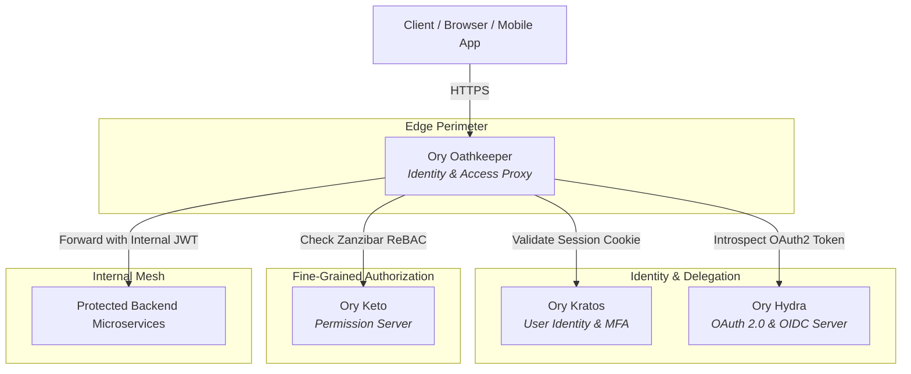

# Ory Suite Skill

> [!IMPORTANT]
> **Zero-Trust & Headless Identity Directive**:
> The Ory Suite enforces strict separation of concerns across the security lifecycle:
> - **Authentication & User Management**: [Ory Kratos](./references/kratos.md) (*"Who are you?"*)
> - **OAuth 2.0 & OIDC Delegation**: [Ory Hydra](./references/hydra.md) (*"What third-party app can act on your behalf?"*)
> - **Fine-Grained Authorization & ReBAC**: [Ory Keto](./references/keto.md) (*"What specific resources can you access?"*)
> - **Zero-Trust Identity & Access Proxy**: [Ory Oathkeeper](./references/oathkeeper.md) (*"Can this HTTP request enter the perimeter?"*)
> - **Managed Platform & Tooling**: [Ory Network, Elements & CLI](./references/network-and-cli.md) (Serverless edge, React UI components, `ory tunnel`, and developer tools)
> - **System Architecture & Synergy**: [Ecosystem Architecture Guide](./references/architecture.md) (End-to-end request pipelines, multi-tenancy, and token exchange)

---

## 1. Ecosystem Overview

The Ory ecosystem is a modular, API-first identity and access infrastructure. Rather than relying on a bulky, monolithic identity provider that combines UI, storage, and protocol logic into one brittle binary, Ory isolates each responsibility into independent, high-performance Go microservices.



### The Ory Suite Applications at a Glance

| Component | Responsibility | Standard Ports | Primary SDK Class |
| :--- | :--- | :--- | :--- |
| [**Ory Kratos**](./references/kratos.md) | User registration, login, passkeys, WebAuthn, TOTP, recovery, verification, profile traits | Public: `4433`<br/>Admin: `4434` | `FrontendApi`<br/>`IdentityApi` |
| [**Ory Hydra**](./references/hydra.md) | Certified OAuth 2.0 and OpenID Connect (OIDC) engine, token minting, login/consent flows | Public: `4444`<br/>Admin: `4445` | `OAuth2Api` |
| [**Ory Keto**](./references/keto.md) | Relationship-Based Access Control (ReBAC) based on Google Zanzibar, Ory Permission Language (OPL) | Read: `4466`<br/>Write: `4467` | `PermissionApi`<br/>`RelationshipApi` |
| [**Ory Oathkeeper**](./references/oathkeeper.md) | Zero-Trust reverse proxy and Decision API; authenticates, authorizes, and mutates incoming HTTP calls | Proxy: `4455`<br/>API: `4456` | Reverse Proxy / Envoy `ext_authz` |
| [**Ory Network & CLI**](./references/network-and-cli.md) | Managed globally distributed edge platform, `ory` CLI, `ory tunnel`, `@ory/elements` UI library | SaaS Edge / 4000 (tunnel) | `@ory/client`<br/>`@ory/elements` |

---

## 2. Quick Reference & Setup

### Package Installation

```bash
# Node.js / TypeScript SDK
npm install @ory/client @ory/elements

# For Keto Ory Permission Language (OPL) type checking
npm install --save-dev @ory/keto-namespace-types

# Python SDK
pip install ory-client

# Ory Unified CLI
npm install -g @ory/cli
# or: brew install ory/tap/ory
```

### Unified Client Initialization

The official `@ory/client` SDK provides typed access to all Ory services:

```typescript
import {
  Configuration,
  FrontendApi,
  IdentityApi,
  OAuth2Api,
  PermissionApi,
  RelationshipApi,
} from '@ory/client';

// 1. Frontend / Browser Client (Session cookies enabled)
export const oryFrontend = new FrontendApi(
  new Configuration({
    basePath: process.env.NEXT_PUBLIC_ORY_SDK_URL || 'http://localhost:4000',
    baseOptions: {
      withCredentials: true, // Crucial for cross-origin / same-site cookies
    },
  })
);

// 2. Privileged Backend / Admin Client (API key authenticated)
const adminConfig = new Configuration({
  basePath: process.env.ORY_SDK_URL || 'http://localhost:4434',
  accessToken: process.env.ORY_API_KEY, // Project API key (ory_pat_...)
});

export const oryIdentity = new IdentityApi(adminConfig);
export const oryOAuth2 = new OAuth2Api(adminConfig);
export const oryPermissions = new PermissionApi(adminConfig);
export const oryRelationships = new RelationshipApi(adminConfig);
```

---

## 3. Core Implementation Patterns

### 3.1 Session Verification Middleware (Next.js / Node.js)
```typescript
import { Request, Response, NextFunction } from 'express';
import { oryFrontend } from './ory';

export async function requireAuth(req: Request, res: Response, next: NextFunction) {
  try {
    const { data: session } = await oryFrontend.toSession({
      cookie: req.headers.cookie,
      xSessionToken: req.headers['x-session-token'] as string,
    });

    if (!session.active) {
      return res.status(401).json({ error: 'Session is inactive' });
    }

    req.user = session.identity;
    return next();
  } catch (err) {
    return res.status(401).json({ error: 'Unauthenticated' });
  }
}
```

### 3.2 Fine-Grained Authorization Check (Ory Keto ReBAC)
```typescript
import { oryPermissions } from './ory';

export async function canEditDocument(userId: string, documentId: string): Promise<boolean> {
  try {
    const { data } = await oryPermissions.checkPermission({
      namespace: 'Document',
      object: documentId,
      relation: 'write',
      subjectId: userId,
    });
    return Boolean(data.allowed);
  } catch (error) {
    return false;
  }
}
```

### 3.3 Handling Hydra OAuth2 Login Challenges
```typescript
import { oryOAuth2 } from './ory';

export async function processOAuth2Login(loginChallenge: string, sessionUserId?: string) {
  // 1. Fetch challenge info
  const { data: loginReq } = await oryOAuth2.getOAuth2LoginRequest({ loginChallenge });

  // 2. If already authenticated with Hydra, accept immediately
  if (loginReq.skip) {
    const { data } = await oryOAuth2.acceptOAuth2LoginRequest({
      loginChallenge,
      acceptOAuth2LoginRequest: { subject: loginReq.subject },
    });
    return { redirect: data.redirect_to };
  }

  // 3. If authenticated via Kratos session, accept with Kratos identity ID
  if (sessionUserId) {
    const { data } = await oryOAuth2.acceptOAuth2LoginRequest({
      loginChallenge,
      acceptOAuth2LoginRequest: {
        subject: sessionUserId,
        remember: true,
        remember_for: 3600 * 24 * 30, // 30 days
      },
    });
    return { redirect: data.redirect_to };
  }

  return { showLoginScreen: true };
}
```

---

## 4. Critical Architecture Rules & Pitfalls

> [!CAUTION]
> **Admin Port Security**:
> **NEVER expose Ory admin ports to the public internet:**
> - Kratos Admin: `4434`
> - Hydra Admin: `4445`
> - Keto Write: `4467`
> - Oathkeeper API: `4456`
> Exposing admin endpoints allows unauthorized identity injection, token forgery, and permission escalation. Restrict admin endpoints to private virtual networks or require mTLS.

> [!IMPORTANT]
> **Local Development with `ory tunnel`**:
> - Browser security policies prevent cookies set on `https://*.projects.oryapis.com` from being shared with `http://localhost:3000`.
> - Always run `ory tunnel --project <project-id> http://localhost:3000` to mirror Ory APIs locally onto port `4000`.
> - *Note: The legacy `ory proxy` command is deprecated; always use `ory tunnel`.*

> [!TIP]
> **Browser vs. API Flows**:
> - Browser flows (`/self-service/.../browser`) require anti-CSRF cookies and produce HTTP-only cookies.
> - API flows (`/self-service/.../api`) do not require anti-CSRF tokens and return an `X-Session-Token` string for mobile apps and CLI clients.

---

## 5. Detailed App References

Deep dive into individual components of the Ory Suite:
*   [**Ory Kratos Reference**](./references/kratos.md): Self-service flows (login, registration, recovery, verification), JSON identity schemas, MFA/Passkeys, and webhooks.
*   [**Ory Hydra Reference**](./references/hydra.md): OAuth 2.0 & OIDC workflows, Login & Consent Provider contracts, PKCE, token strategies (JWT vs. Opaque), and client management.
*   [**Ory Keto Reference**](./references/keto.md): Google Zanzibar ReBAC data model, Ory Permission Language (OPL), relation tuples, Check & Expand APIs.
*   [**Ory Oathkeeper Reference**](./references/oathkeeper.md): Reverse Proxy vs. Decision API modes, the 4-stage pipeline (Match $\to$ Authenticate $\to$ Authorize $\to$ Mutate), and production access rules.
*   [**Ory Network & CLI Reference**](./references/network-and-cli.md): Managed cloud edge, `ory tunnel`, React UI integration with `@ory/elements`, and CLI workflows.
*   [**System Architecture & Synergy**](./references/architecture.md): Zero-Trust request flows, multi-tenancy, and end-to-end integration patterns.

---

## 6. Runnable Examples

*   [TypeScript SDK Examples (`typescript-examples.ts`)](./examples/typescript-examples.ts): Full implementations for `FrontendApi`, `IdentityApi`, `OAuth2Api`, `PermissionApi`, `RelationshipApi`, and Keto OPL classes.
*   [Python SDK Examples (`python-examples.py`)](./examples/python-examples.py): FastAPI middleware, session authentication, admin identity operations, Hydra login/consent routes, and Keto checks.
*   [Local Docker Compose Stack (`docker-compose.yml`)](./examples/docker-compose.yml): Production-ready multi-container local environment running PostgreSQL, MailSlurper, Kratos, Hydra, Keto, and Oathkeeper.
