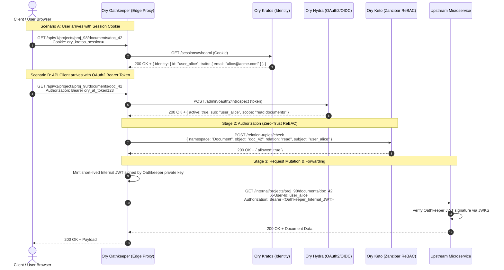

# Ory Suite Architecture: Zero-Trust Ecosystem Synergy

The Ory Suite is designed around the **Zero Trust Security Model**, which operates under the principle: *"Never trust, always verify."* Rather than relying on a monolithic identity service, Ory divides security responsibilities across four distinct, composable, headless services.

---

## 1. Separation of Concerns Matrix

| Service | Primary Role | Core Question Answered | Standard Protocols / Models |
| :--- | :--- | :--- | :--- |
| **Ory Kratos** | Identity & User Management | *"Who are you?"* | JSON Schema, Passkeys/WebAuthn, TOTP, Argon2id |
| **Ory Hydra** | OAuth 2.0 & OIDC Authorization Server | *"What third-party apps can act on your behalf?"* | OAuth 2.0 (RFC 6749), OIDC Core 1.0, PKCE, JWKS |
| **Ory Keto** | Fine-Grained Access Control | *"What specific resources are you permitted to touch?"* | Google Zanzibar, ReBAC, RBAC, ACL, OPL |
| **Ory Oathkeeper** | Identity & Access Proxy (IAP) / Decision API | *"Can this HTTP packet enter the perimeter, and in what format?"* | Reverse Proxy, Envoy `ext_authz`, JWT Mutator, Header Mutator |

---

## 2. End-to-End Request Life-Cycle

The diagram below illustrates how all four services cooperate during an authenticated API request in an enterprise Zero-Trust infrastructure:



---

## 3. Core Architectural Patterns

### 3.1 Headless Presentation Pattern
*   Ory Kratos and Hydra **never render user interfaces directly**.
*   Instead, your custom application (Next.js, Remix, Vue, React Native, iOS, Android) renders the forms.
*   This prevents UI vendor lock-in, ensures full brand control, and guarantees compliance with accessibility standards (WCAG 2.1 AA / AODA).

### 3.2 Perimeter Defense-in-Depth (The Oathkeeper Shield)
*   **No backend microservice is directly exposed to the public internet.**
*   All ingress traffic hits Ory Oathkeeper (or an Envoy/Traefik gateway backed by Oathkeeper's Decision API).
*   Oathkeeper terminates external cookies and opaque OAuth2 tokens at the perimeter, mutates the request into a cryptographically verified internal JWT (`id_token` mutator), and forwards only trusted identity claims to internal microservices.

### 3.3 Zanzibar Relationship-Based Access Control (ReBAC)
*   Instead of hardcoding role checks (`if (user.role === 'admin')`) across disparate microservices, all access decisions query Ory Keto.
*   Relationship hierarchies (e.g. User $\to$ Team $\to$ Project $\to$ Document) are centralized in Keto's high-speed in-memory graph.
*   When a user is removed from a team, their access to all documents in that team is instantly revoked across all services without changing individual document ACLs.

### 3.4 Multi-Tenancy Architecture
*   **Identity Partitioning (Kratos)**:
    *   Tenant IDs are embedded in identity traits: `traits: { tenant_id: "org_123", email: "..." }`.
    *   Kratos supports multiple identity schemas for different user classes (e.g. internal employees vs. B2B tenant customers vs. consumer end-users).
*   **Access Isolation (Keto)**:
    *   Tenancy is modeled explicitly in the Ory Permission Language (OPL):
        ```typescript
        class Document implements Namespace {
          related: { tenant: Organization[] }
          permits = {
            read: (ctx: Context) => this.related.tenant.traverse(t => t.permits.isMember(ctx))
          }
        }
        ```
*   **API Client Scoping (Hydra)**:
    *   OAuth2 clients can be scoped to specific audiences (`aud: ["tenant_123"]`) or specific scopes (`org:tenant_123:admin`).

---

## 4. Production Deployment Topologies

### 4.1 Topology A: Fully Managed (Ory Network)
*   Kratos, Hydra, and Keto run as serverless, autoscaling endpoints on the globally distributed Ory Network edge.
*   Your applications communicate via `@ory/client` pointing to `https://<slug>.projects.oryapis.com`.
*   Zero database maintenance, zero certificate rotation burden.

### 4.2 Topology B: Self-Hosted Kubernetes / Cloud-Native
*   Each Ory service deployed as a Kubernetes Deployment with horizontal pod autoscalers (HPA).
*   PostgreSQL running on Amazon RDS, Google Cloud SQL, or Azure Database for PostgreSQL.
*   Oathkeeper deployed either as:
    1.  An Ingress Controller / Reverse Proxy.
    2.  An `ext_authz` sidecar next to Envoy / Traefik Ingress.
*   Inter-service communication secured via mTLS (Istio, Linkerd, or Cilium).
