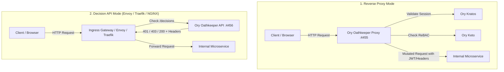

# Ory Oathkeeper Reference: Identity & Access Proxy (IAP) and Decision API

Ory Oathkeeper is a cloud-native, Zero-Trust Identity and Access Proxy (IAP) and Access Control Decision API. It intercepts incoming HTTP requests, validates credentials against identity providers (like Ory Kratos and Ory Hydra), authorizes actions against policy engines (like Ory Keto), mutates headers/tokens to pass trusted identity claims to upstream services, and handles errors with redirects or JSON responses.

---

## 1. Operating Modes

Ory Oathkeeper can be deployed in two primary operational architectures:



### 1.1 Reverse Proxy Mode (`serve proxy`)
*   Oathkeeper acts as the entry point reverse proxy on port `4455`.
*   Directly handles upstream routing, path rewriting, SSL termination (optional), and request forwarding.
*   Ideal for monolithic edge gateways or containerized sidecar setups.

### 1.2 Decision API Mode (`serve api`)
*   Oathkeeper runs standalone on port `4456` exposing the `/decisions` endpoint.
*   An external gateway (Envoy `ext_authz`, Traefik `ForwardAuth`, NGINX `auth_request`, Kubernetes Ingress) asks Oathkeeper whether to allow each request.
*   If Oathkeeper responds `200 OK`, the external proxy forwards the request along with mutated headers returned by Oathkeeper.

---

## 2. The 4-Stage Rule Pipeline

Every matched request flows through four discrete stages:

```text
[Incoming Request] 
      │
      ▼
1. Matcher ─────────► Matches URL pattern, HTTP methods, and Host
      │
      ▼
2. Authenticator ───► Verifies Identity (Kratos Cookie, Hydra JWT, Bearer token)
      │
      ▼
3. Authorizer ──────► Evaluates Permissions (Keto ReBAC check, Remote JSON, Allow/Deny)
      │
      ▼
4. Mutator ─────────► Rewrites request (Mints Internal JWT, Injects X-User-* Headers)
      │
      ▼
[Upstream Service]  (Or Error Handler if any step fails)
```

---

## 3. Pipeline Handlers Reference

### 3.1 Authenticators
| Authenticator Handler | Description | Primary Use Case |
| :--- | :--- | :--- |
| `anonymous` | Assigns an anonymous guest subject to unauthenticated requests | Public guest endpoints |
| `cookie_session` | Calls Kratos `/sessions/whoami` to validate session cookies | Browser/SPA frontend apps |
| `jwt` | Verifies cryptographically signed JWTs using public JWKS URLs | Mobile apps, OAuth2 clients |
| `oauth2_introspection` | Calls Hydra `/admin/oauth2/introspect` for opaque tokens | Machine-to-machine, OAuth2 |
| `oauth2_client_credentials` | Validates HTTP Basic client credentials directly | Direct service authentication |
| `noop` | Performs no authentication; passes through | Public static assets |
| `unauthorized` | Instantly rejects request with 401 Unauthorized | Disabled endpoints |

### 3.2 Authorizers
| Authorizer Handler | Description | Primary Use Case |
| :--- | :--- | :--- |
| `allow` | Permits all authenticated requests | Endpoints requiring only valid login |
| `deny` | Denies all requests | Completely blocked paths |
| `remote_json` | Sends HTTP POST payload to Ory Keto or custom authorization webhook | Fine-grained Zanzibar ReBAC checks |
| `keto_engine_acp_ory` | Legacy Keto Access Control Policy engine | Deprecated Keto v0.5 policies |

### 3.3 Mutators
| Mutator Handler | Description | Primary Use Case |
| :--- | :--- | :--- |
| `header` | Injects plaintext HTTP headers (`X-User-Id`, `X-User-Email`) | Lightweight upstream microservices |
| `id_token` | Mints a new, cryptographically signed, short-lived JWT signed by Oathkeeper | Zero-Trust defense-in-depth |
| `cookie` | Injects or transforms HTTP cookies | Upstreams requiring specific cookies |
| `hydrator` | Calls external HTTP service to fetch additional user metadata | Enriching user context dynamically |
| `noop` | Forwards original request headers unchanged | Transparent proxying |

### 3.4 Error Handlers
| Error Handler | Description |
| :--- | :--- |
| `json` | Returns standard JSON error body with appropriate HTTP status code (`401` or `403`). |
| `redirect` | Redirects unauthenticated browser requests to a login URL (e.g. Ory Kratos login). |

---

## 4. Production Access Rules Example (`rules.json`)

```json
[
  {
    "id": "documents-api-rule",
    "version": "v0.40.0",
    "upstream": {
      "preserve_host": true,
      "strip_path": "/api/v1",
      "url": "http://document-service:8080"
    },
    "match": {
      "url": "https://api.mycompany.com/api/v1/documents/<[a-zA-Z0-9-]+>",
      "methods": ["GET"]
    },
    "authenticators": [
      {
        "handler": "cookie_session",
        "config": {
          "check_session_url": "http://kratos:4433/sessions/whoami",
          "preserve_path": true,
          "extra_from": "@this",
          "subject_from": "identity.id",
          "only": ["ory_kratos_session"]
        }
      },
      {
        "handler": "jwt",
        "config": {
          "jwks_urls": [
            "http://hydra:4444/.well-known/jwks.json"
          ],
          "scope_strategy": "wildcard",
          "required_scope": ["read:documents"]
        }
      }
    ],
    "authorizer": {
      "handler": "remote_json",
      "config": {
        "remote": "http://keto:4466/relation-tuples/check",
        "payload": "{\"namespace\":\"Document\",\"object\":\"{{ print (index .MatchContext.RegexpCaptureGroups 0) }}\",\"relation\":\"read\",\"subject_id\":\"{{ print .Subject }}\"}"
      }
    },
    "mutators": [
      {
        "handler": "id_token",
        "config": {
          "issuer_url": "https://api.mycompany.com/",
          "jwks_url": "file:///etc/config/oathkeeper/id_token.jwks.json",
          "ttl": "5m",
          "claims": "{\"sub\":\"{{ print .Subject }}\",\"email\":\"{{ print .Extra.identity.traits.email }}\"}"
        }
      },
      {
        "handler": "header",
        "config": {
          "headers": {
            "X-User-Id": "{{ print .Subject }}"
          }
        }
      }
    ],
    "errors": [
      {
        "handler": "json"
      }
    ]
  }
]
```

---

## 5. Configuration Reference (`oathkeeper.yml`)

```yaml
version: v0.40.0

serve:
  proxy:
    port: 4455
  api:
    port: 4456

access_rules:
  matching_strategy: glob
  repositories:
    - file:///etc/config/oathkeeper/rules.json

authenticators:
  anonymous:
    enabled: true
    config:
      subject: guest
  cookie_session:
    enabled: true
    config:
      check_session_url: http://kratos:4433/sessions/whoami
      preserve_path: true
      extra_from: "@this"
      subject_from: "identity.id"
      only:
        - ory_kratos_session
  jwt:
    enabled: true
    config:
      jwks_urls:
        - http://hydra:4444/.well-known/jwks.json
  noop:
    enabled: true

authorizers:
  allow:
    enabled: true
  remote_json:
    enabled: true

mutators:
  noop:
    enabled: true
  header:
    enabled: true
  id_token:
    enabled: true
    config:
      issuer_url: http://localhost:4455/
      jwks_url: file:///etc/config/oathkeeper/id_token.jwks.json
      ttl: 5m

errors:
  handlers:
    json:
      enabled: true
      config:
        verbose: true
    redirect:
      enabled: true
      config:
        to: http://localhost:3000/login
```

---

## 6. CLI Reference (`oathkeeper`)

```bash
# Validate access rules JSON/YAML
oathkeeper rules validate /etc/config/oathkeeper/rules.json

# Start Oathkeeper reverse proxy mode
oathkeeper serve proxy -c /etc/config/oathkeeper/oathkeeper.yml

# Start Oathkeeper decision API mode
oathkeeper serve api -c /etc/config/oathkeeper/oathkeeper.yml

# Check health
curl http://localhost:4456/health/ready
```
